# Tutorial CD with Keptn tested by Hey

This is a git repository containing a tutorial for setting up a continuous deployment with Keptn ([https://keptn.sh/](https://keptn.sh/)) for an example application that is tested by Hey ([https://github.com/rakyll/hey](https://github.com/rakyll/hey)) and monitored by Dynatrace ([https://www.dynatrace.com/](https://www.dynatrace.com/)).

Keptn is a tool for an event-based control plane for continuous deployment and automated operations for cloud-native applications. Hey is a load generator for web applications. Dynatrace is used in this tutorial for production monitoring.

## Create and deploy an application


- Implement your own web application:
  - For this tutorial an angular weather-app was implemented, which displays the requested weather data from the open weather API ([https://openweathermap.org/api](https://openweathermap.org/api)) and displays the results.

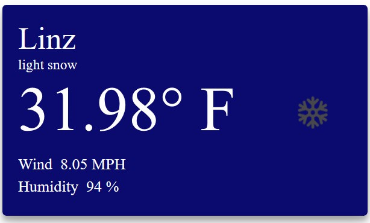

  - Make sure that the application has a _/health_ endpoint which returns a 200 http status code for the liveness and readiness probe for the helm chart in section _onboard first microservice._

- Create a Docker image for your application. For example to dockerize an angular app use the following Dockerfile:


```dockerfile
FROM node:12.7-alpine AS build
WORKDIR /usr/src/app
COPY package.json package-lock.json ./
RUN npm install
COPY . .
RUN npm run build:ssr


CMD ["npm", "run", "start"]
```


- Push the created Docker image to your Dockerhub account with the following command:

```docker push YOUR-ACCOUNT/YOUR-APPLICATION```

## Hey Service


- Create a Hey service for testing the response time of your application.
- Start off with the following go-template [https://github.com/keptn-sandbox/keptn-service-template-go](https://github.com/keptn-sandbox/keptn-service-template-go) and execute the following steps:
  - Replace every occurrence of &quot;keptn-service-template-go&quot; with &quot;hey-service&quot;.
  - Replace every occurrence of (Docker) image names and tags from keptnsandbox/keptn-service-template-go to your Docker organization and image name (e.g., YOUR-ACCOUNT/hey-service).
  - Download the Linux version of Hey ([https://hey-release.s3.us-east-2.amazonaws.com/hey\_linux\_amd64](https://hey-release.s3.us-east-2.amazonaws.com/hey_linux_amd64)) and save it in the root directory of the Hey service for executing the Hey test.
  - Change the HandleDeploymentFinishedEvent function in the eventhandlers.go file to send 200 requests and test the availability of the application:

``` go
func HandleDeploymentFinishedEvent(myKeptn *keptn.Keptn, incomingEvent cloudevents.Event, data *keptn.DeploymentFinishedEventData) error {
	log.Printf("Handling Deployment Finished Event: %s", incomingEvent.Context.GetID())

	// capture start time for tests
	startTime := time.Now()

	// Send Test Finished Event
	// default 200 requests are sent
	url := data.Service + "." + data.Project + "-" + data.Stage + ".svc.cluster.local"
	log.Printf("Sending test requests to %s", url)
	cmd := exec.Command("./hey_linux_amd64", url)

	stdoutStderr, err := cmd.CombinedOutput()
	if err == nil {
		return myKeptn.SendTestsFinishedEvent(&incomingEvent, "", "", startTime, "pass", nil, "hey-service")
	}
	if stdoutStderr != nil {
		log.Printf("%s\n", stdoutStderr)
	}
	log.Printf("Error occured when running hey %v", err)
	
	return myKeptn.SendTestsFinishedEvent(&incomingEvent, "", "", startTime, "fail", nil, "hey-service")
}
```

- Insert the following line into the Dockerfile to include the Hey binary:

```dockerfile
COPY --from=builder /src/hey-service/hey_linux_amd64 /hey_linux_amd64
```

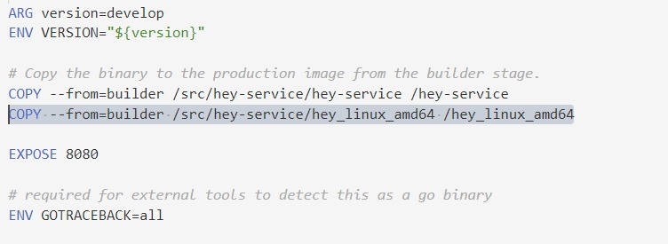

## Setup Google Cluster:


- At first create a big enough cluster in the Google Kubernetes Engine with the following settings:
  - Nodes: 1
  - Image Type: ubuntu
  - VM: 8v 32GB

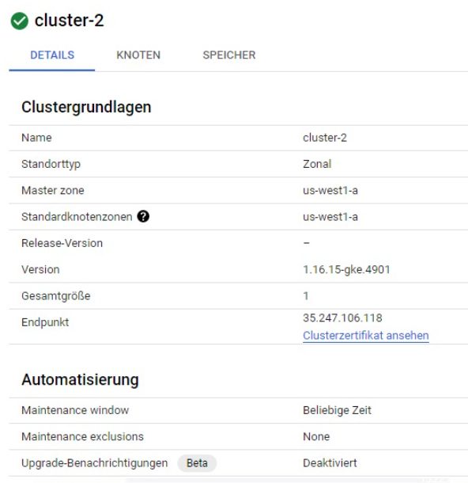

- Create a connection with the cluster in the cloudshell.

## Setup Keptn:


- For easier execution use the Linux subsystem for Windows or Linux.
- For the following steps follow the instructions in [https://tutorials.keptn.sh/tutorials/keptn-upscaling-dynatrace-07/index.html#2](https://tutorials.keptn.sh/tutorials/keptn-upscaling-dynatrace-07/index.html#2)
  - Download and install Istio (Step 3).

Istio creates the connection between your Google Cluster and Keptn.

  - Download and install Keptn (Step 4-5).
  - Configure Keptn and Istio (Step 6).

Istio will be configured for traffic routing and as an ingress to the Google cluster.

  - Connect your Keptn CLI to the Keptn installation (Step 7)
- Setup Dynatrace for monitoring the application:
  - Create an account at [https://www.dynatrace.com](https://www.dynatrace.com/).
  - Execute the steps 9-11 in [https://tutorials.keptn.sh/tutorials/keptn-upscaling-dynatrace-07/index.html#8](https://tutorials.keptn.sh/tutorials/keptn-upscaling-dynatrace-07/index.html#8)

## Deploy and Test the Application


- At first deploy the Hey service with the following commands executed in the Hey service directory:

```kubectl apply -f deploy/service.yaml```

```kubectl -n keptn set image deployment/hey-service hey-service=YOUR-DOCKER-ACCOUNT/hey-service:$VERSION –record```

- Create a Git repository.

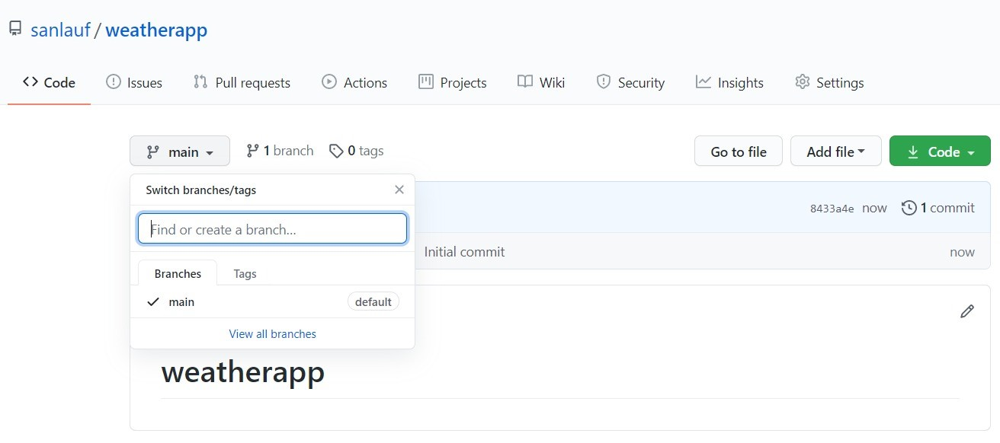

- Create a shipyard.yaml file for defining the stages and their test/deployment strategies. In our example we have three stages. For the dev stage direct deployment is used and for staging and production the blue\_green deployment strategy.

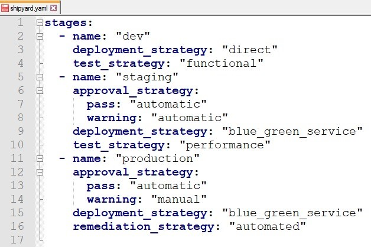

- Create a Keptn project with the following command:

```keptn create project YOUR-PROJECT --shipyard=./shipyard.yaml --git-user=YOUR-USER --git-token=YOUR-GITTOKEN --git-remote-url=YOUR-REPOSITORY-URL```

In the following screenshots the created stages are shown on Github and Keptn:

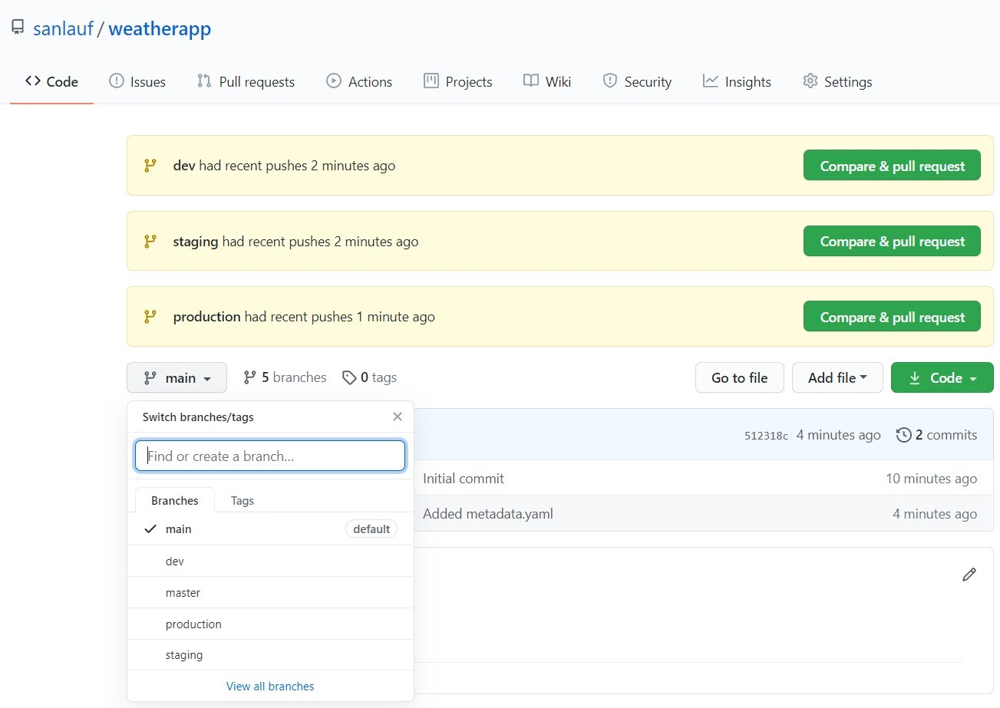

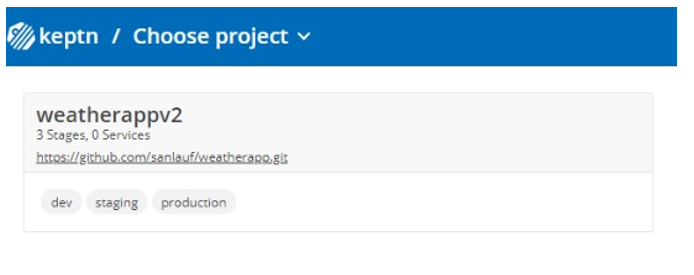

- To onboard your first microservice download a template helm chart from [https://github.com/keptn/examples/tree/master/onboarding-carts/carts](https://github.com/keptn/examples/tree/master/onboarding-carts/carts) and adapt it for your service. Then execute the following command:

```keptn onboard service YOUR-SERVICE --project=YOUR-PROEJCT --chart=./YOUR-SERVICE```

You can now detect the change of the number of services:


- To deploy your first build or a new version with Keptn send a new artefact of your project with the following command:

```keptn send event new-artifact --project=YOUR-PROJECT --service=YOUR-SERVICE --image=YOUR-DOCKERIMAGE-URL```

Verify the pods that should have been created for the service execute the following command:

```kubectl get pods --all-namespaces | grep YOUR-PROJECT```

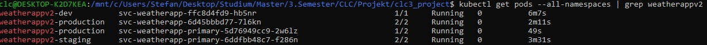

In the following screenshots you can notice the triggered events:

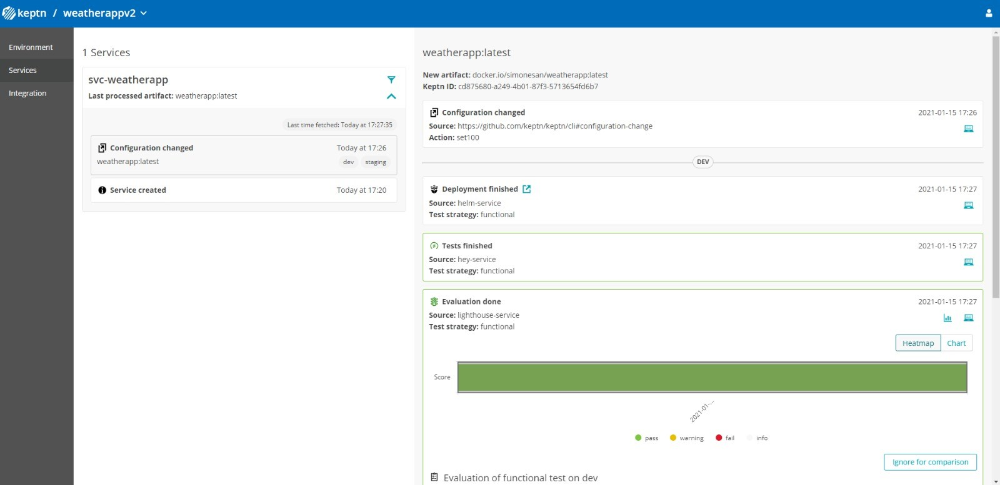

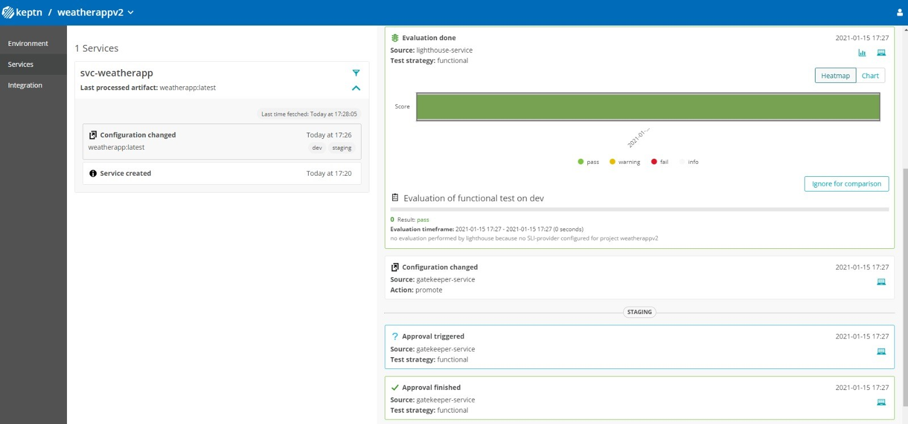

- To view your application execute the following command to get the URLs of your application in the different stages:

```kubectl get vs –n YOUR-PROJECT-STAGE```

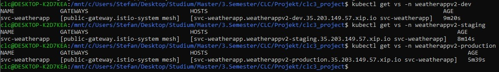

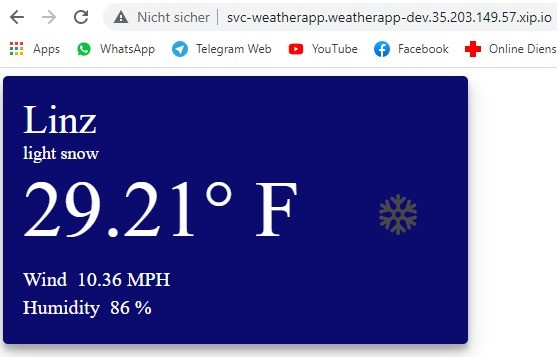

- To connect your project with Dynatrace execute the following commands:

```kubectl apply -f https://raw.githubusercontent.com/keptn-contrib/dynatrace-sli-service/0.7.1/deploy/service.yaml -n keptn```

```keptn add-resource --project=YOUR-PROJECT --resource=sli-config-dynatrace.yaml --resourceUri=dynatrace/sli.yaml```

```keptn configure monitoring dynatrace --project=YOUR-PROJECT```

On your Dynatrace Dashboard you can now monitor your application.


